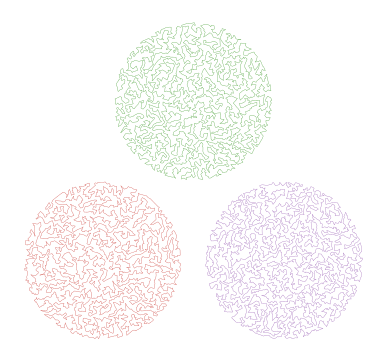

# TSPImages.jl
This is a small and rough personal project which attempts to generate instances of the traveling
salesman problem from images and then solve those TSP instances; the solved instances
should roughly resemble the original image. The inspiration is this
[TSP-style Mona Lisa](http://www.math.uwaterloo.ca/tsp/data/ml/monalisa.html).

Packages used include:
* [TravelingSalesmanHeuristics.jl](https://github.com/evanfields/TravelingSalesmanHeuristics.jl)
* [Gadfly.jl](http://gadflyjl.org/stable/) for plotting
* [LightGraphs.jl](https://github.com/JuliaGraphs/LightGraphs.jl) for separating groups of points into components
* The [Images.jl](https://github.com/JuliaImages/Images.jl) ecosystem for, shockingly, image manipulations.

